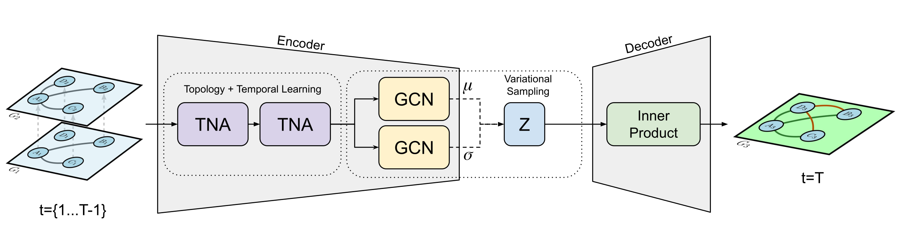

# Temporal Neighbourhood Aggregation

Code for the IEEE Big Data 2019 paper entitled 'Temporal Neighbourhood Aggregation: Predicting Future Links in Temporal Graphs via Recurrent Variational Graph Convolutions' A pre-print version of the paper can be found here - https://arxiv.org/abs/1908.08402

This model is designed to predict the next graph snapshot in a temporal graph using recurrent Variational Graph Convolutions. 



## Dependencies and Requirements

The code has been designed to support python 3.7+ only. The project has the following dependences and version requirements:

- python 3.7+
- pytorch 1.2+
- numpy 1.16+
- scipy 1.1+
- scikit-learn 0.21+
- graph_tool 2.28+

## Datasets and Processing

The results in the paper are presented on three empirical graph datasets taken from the Stanford Network Analysis Project:

- Bitcoin-Alpha: https://snap.stanford.edu/data/soc-sign-bitcoin-alpha.html
- Wiki Vote: https://snap.stanford.edu/data/wiki-Vote.html
- UCI Messages: https://snap.stanford.edu/data/index.html

The `data_utils.py` file can be used to convert the datasets into the numpy matrices needed by the TNA model. 


## Running the Model

The model can be run using the following command - 

`python train_TNA.py --dataset='wiki' --seq_len=3 --num_epochs=50 --rnn_model='GRU' --data_loc`

Please not that the `data_loc` flag must be set to the location of your dataset.

## Cite

Please cite the associated papers for this work if you use this code:

```
@inproceedings{bonner2019temporal,
  title={Temporal Neighbourhood Aggregation: Predicting Future Links in Temporal Graphs via Recurrent Variational Graph Convolutions},
  author={Bonner, Stephen and Atapour-Abarghouei, Amir and Jackson, Philip T and Brennan, John and Kureshi, Ibad and Theodoropoulos, Georgios and McGough, Andrew Stephen and Obara, Boguslaw},
  booktitle={2019 IEEE International Conference on Big Data (Big Data)},
  pages={5336--5345},
  year={2019},
  organization={IEEE}
}

```
